# 🎙️ Voice to Asana Automation


> **Turn unstructured voice notes into actionable project management.**

This tool bridges the gap between voice recordings and Asana. It takes transcribed text, parses it via a CSV workflow, and interacts with the Asana REST API to automatically generate tasks and subtasks.

Ideally suited for converting meeting transcripts, voice memos, or brain dumps into structured work without manual data entry.

---

## ✨ Features

- **📄 Transcript to Structure:** Converts flat CSV text into hierarchical Asana objects.
- **✅ Auto-Creation:** Generates parent Tasks and nested Subtasks in one go.
- **🔗 Idempotency & Registry:** Writes back stable Asana GIDs to your CSV to prevent duplicates and allow for future updates.
- **🔌 Extensible:** Designed as a modular foundation for meeting bots or voice assistants.

---

## 🔄 Workflow

The system follows a linear pipeline from audio source to API execution.

```mermaid
graph LR
    A[📱 Audio/Voice] -->|Transcribe| B[📝 Transcript Text]
    B -->|Format| C[📊 Input CSV]
    C -->|Run Script| D[⚡ Python Automation]
    D -->|Request| E[☁️ Asana API]
    E -->|Response| F[✅ Asana Tasks]
    D -->|Write Back| G[💾 Output Registry CSV]
```



### System Overview

1.  **Input:** You provide a structured CSV derived from your audio transcript.
2.  **Process:** The script iterates through the rows, grouping subtasks under parent tasks based on name.
3.  **Action:** It hits the Asana API to create the items.
4.  **Output:** It generates a "Registry CSV" containing the new Asana IDs for your records.

---

## 📂 Repository Structure

```text
src/
  app.py                # Entry point (CLI wrapper)
  csv_to_asana.py       # Core logic & Asana API interaction
  config_example.py     # Template for tokens (Rename to config.py)
data/
  samples/
    tasks_sample.csv           # Input template
    tasks_with_ids_sample.csv  # Output example
docs/
  architecture.md       # Detailed design docs
  article_linkedin.md   # Context and backstory
```

---

## 🚀 Getting Started

### Prerequisites

* Python 3.8+
* An Asana account with a Personal Access Token (PAT)

### Installation

1.  **Clone the repository**

    ```bash
    git clone [https://github.com/tabitha-dev/voice-to-asana-tasks.git](https://github.com/tabitha-dev/voice-to-asana-tasks.git)
cd voice-to-asana-tasks
    ```

2.  **Install dependencies**

    ```bash
    pip install -r requirements.txt
    ```

3.  **Configuration**

    Create a `config.py` file in the `src` folder.

    > [!IMPORTANT]
    > Never commit your `config.py` to GitHub. Ensure it is listed in your `.gitignore`.

    ```python
    # src/config.py
    ASANA_TOKEN = "1/123456..."
    ASANA_PROJECT_ID = "123456..."
    ```

---

## 📝 Data Format

The script relies on a specific CSV structure.

**Input (`tasks_sample.csv`):**
Multiple rows with the same `task_name` will be treated as a single parent task, with the `subtask_name` entries nested inside it.

| task_name | notes | subtask_name | subtask_notes |
| :--- | :--- | :--- | :--- |
| **Plan Holiday** | Overall planning | Book flights | Compare prices |
| **Plan Holiday** | Overall planning | Reserve hotel | Check options |
| **Pay Bills** | Monthly payments | Pay electric | Due Friday |

```csv
task_name,notes,subtask_name,subtask_notes
Plan holiday trip,"Overall planning","Book flights","Compare prices"
Plan holiday trip,"Overall planning","Reserve hotel","Check options"
Pay bills,"Monthly payments","Pay electricity bill","Due next week"
```

---

## 🏃 Usage

1.  Place your formatted CSV into `data/samples/tasks_sample.csv`.

2.  Run the application:

    ```bash
    python src/app.py
    ```

3.  **Check your results:**
    * Look at your Asana Project to see the new tasks.
    * Check the `data/` folder for a new CSV containing the Asana IDs.

---

## 🔮 Roadmap & Extensions

- [ ] **Integration:** Connect directly to Otter.ai or OpenAI Whisper API.
- [ ] **Chat Ops:** Build a Slack/Teams bot to ingest tasks.
- [ ] **Webhooks:** Two-way sync when tasks are completed in Asana.
- [ ] **Voice:** Integration with Siri/Google Assistant shortcuts.

---

## 📚 Resources

* [Asana Developer Platform](https://asana.com/developers)
* [Asana REST API Reference](https://developers.asana.com/reference/rest-api-reference)
* [Python Client Library](https://github.com/Asana/python-asana)

---

## ❓ Troubleshooting

**Common Issues:**

* **401 Unauthorized:** Check your `ASANA_TOKEN` in `config.py`. It may have expired or been copied incorrectly.
* **400 Bad Request:** Ensure your `ASANA_PROJECT_ID` is correct and that the user account associated with the token has access to that project.
* **CSV Errors:** Make sure your input CSV is UTF-8 encoded and follows the exact header format shown above.

---

## 🤝 Contributing

Contributions are welcome! Please feel free to submit a Pull Request.

1.  Fork the project
2.  Create your feature branch (`git checkout -b feature/AmazingFeature`)
3.  Commit your changes (`git commit -m 'Add some AmazingFeature'`)
4.  Push to the branch (`git push origin feature/AmazingFeature`)
5.  Open a Pull Request

---

## 📄 License

Distributed under the MIT License. See `LICENSE` for more information.
"""
