# 🏗️ Architecture Overview

This project follows a simple but extensible pipeline, transforming unstructured audio into structured Asana work items.

The workflow is designed to be **modular**: each stage is distinct, making it easier to test, debug, and extend.

## 🔄 Data Pipeline

1.  **Audio Capture:** Recording via phone or meeting tool.
2.  **Transcription:** Conversion to raw text.
3.  **Structuring:** Mapping text to our standardized CSV schema (`task_name`, `notes`, `subtasks`).
4.  **Automation:** Python script parses the CSV and groups rows by parent task.
5.  **API Execution:** Calls to the Asana REST API to create resources.
6.  **Registry Update:** Writing stable Asana GIDs back to a new CSV for future reference.

## 🧩 System Diagram

```mermaid
graph TD
    A["🎤 Audio Recording"] -->|Transcribe| B["📄 Transcript Text"]
    B -->|Map Fields| C["📊 CSV Structuring"]
    C -->|Parse & Group| D["⚡ Python Automation Script"]
    D -->|POST /tasks| E["☁️ Asana API"]
    E -->|Return GIDs| D
    D -->|Save IDs| F["💾 Output Registry CSV"]

    subgraph Inputs
    A
    B
    C
    end

    subgraph Core Logic
    D
    end

    subgraph External & Storage
    E
    F
    end
```

This separation of concerns allows us to swap out the transcription engine or change the input format without rewriting the core Asana logic.
